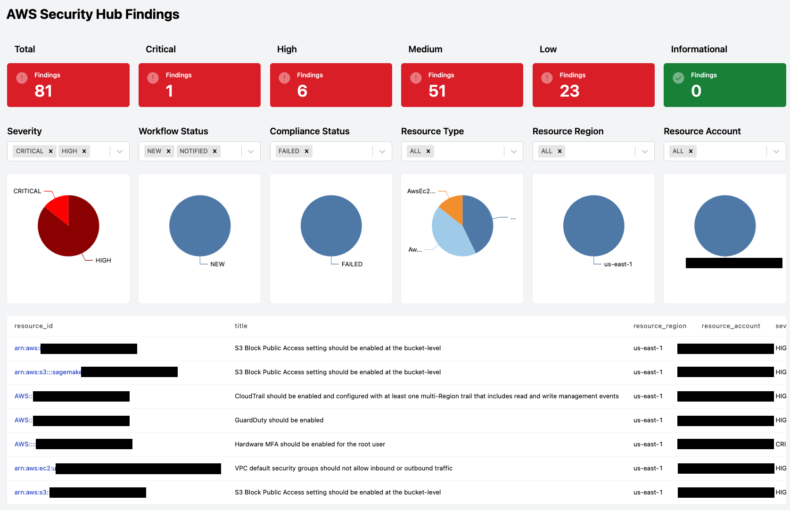
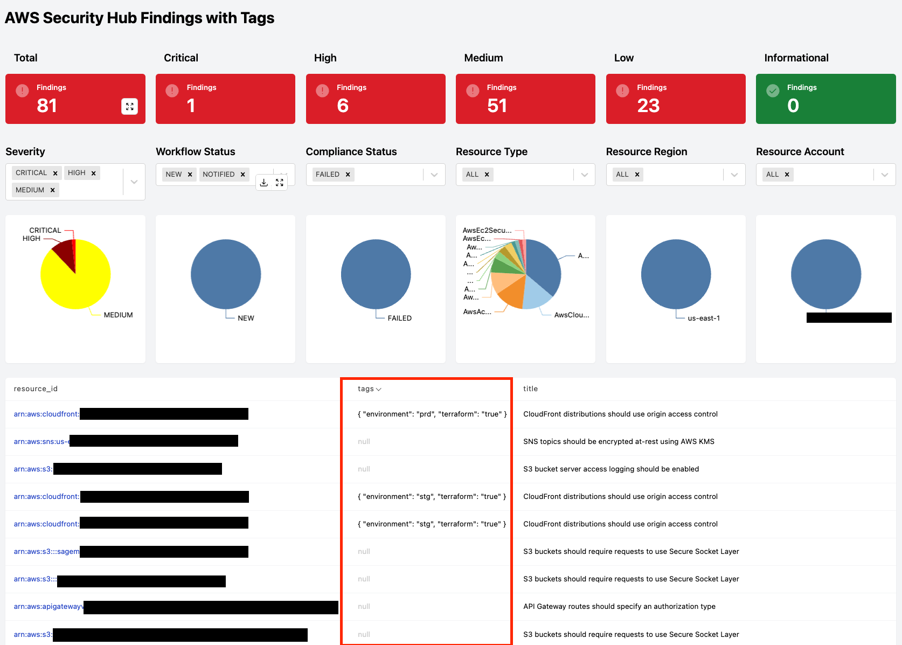

# Steampipe AWS Security Hub Mod

This mod fetches security findings from AWS Security Hub and provides different views to analyze them. Some views combine findings with other sources of information to provide more context, for example, by querying the tagging directly in the affected resource.

Dashboards can be filtered by severity, workflow status, compliance status, resource type, etc. The filters are available at the top of each dashboard.

[Security Hub Findings](dashboards/securityhub_findings.sp): This dashboard provides a view of all security findings in your AWS Security Hub account.



[Security Hub Findings with Tags](dashboards/securityhub_findings_with_tags.sp): This dashboard provides a view of all security findings in your AWS Security Hub account and combines them with tags information by correlating with the information available in the AWS Resource Groups Tagging API (joining by ARN).



## Getting started

### Installation

Download and install Steampipe (https://steampipe.io/downloads). Or use Brew:

```sh
brew tap turbot/tap
brew install Steampipe
```

Install the AWS plugin with [Steampipe](https://steampipe.io):

```sh
steampipe plugin install aws
```

Clone:

```sh
git clone https://github.com/gabrielsoltz/steampipe-mod-aws-securityhub
cd steampipe-mod-aws-security hub
```

### Usage

Start your dashboard server to get started:

```sh
steampipe dashboard
```

## Credentials

This mod uses the credentials configured in the [Steampipe AWS plugin](https://hub.steampipe.io/plugins/turbot/aws).

## Dashboard Configuration

### AWS Security Hub Master Account

AWS Security Hub can show findings from the same account running or configured to aggregate findings from multiple accounts and regions. If this is your case, continue reading.

When reading from AWS Security Hub, which is from multiple accounts, you need to specify the steampipe connection to that account in this mod and avoid using an aggregator, as performance will be drastically affected, and findings could be duplicated.

To define the connector for the master account, you need to set the variable `sh_findings_connection_table` in the `mod.sp` file. The value of this variable is the connector and the table name, which you don't need to change.

### AWS Security Hub Region Aggregator

If aggregating findings from multiple regions, you must also define the master region in the `mod.sp` file using the variable `sh_aggregator_region.` If you are not aggregating findings, you can leave this variable as `ALL`

## Generate Local Tables

Working with security findings can be slow, especially if you have many accounts and findings. To improve performance, you can generate a local table with the findings and use that table in your queries. So you only download the data once, and then you query locally. You can regenerate the table as many times as you want to refresh the data when updating it.

For generating the local tables, the script `generate_findings_local.sh` under the `scripts` folder will create both tables needed in your Steampipe locally.

YOU NEED TO CONFIGURE THE VARIABLES IN THE SCRIPT BEFORE RUNNING IT.

```sh
$ sh scripts/generate_findings_local.sh
Creating Table: local_aws_securityhub_finding
Ok
Creating Table: local_aws_tagging_resource
Ok
```

Once the tables are created, you need to define them using the variables `sh_findings_connection_table` and `aws_tagging_resources_table` like this:

```hcl
variable "sh_findings_connection_table" {
  type = string
  default = "public.local_aws_securityhub_finding"
}


variable "aws_tagging_resources_table" {
  type = string
  default = "public.local_aws_tagging_resource"
}
```

## To Do

- [ ] Filters and Graphs by Tags dimensions
- [ ] Add more dashboards
- [ ] Add custom metrics, like Time to Fix or Time to Notify
- [ ] Make the initial query for fetching findings customizable (e.g., by record state)
- [ ] Documentation

## Filters

Some filter options are fixed when the possible values are known, for example, the workflow status: `NEW,` `NOTIFIED,` `RESOLVED,` and `SUPPRESSED.` Other filters are set to `ALL` as a wildcard, and you can write the value you want to filter by, for example, the resource type. This is for performance reasons. In the future, those values could be populated dynamically.

## Active Findings

Currently, only findings with the record state `ACTIVE` are fetched; this will be configurable in the future, but for visualizing findings, this is the most common use case (active findings).
